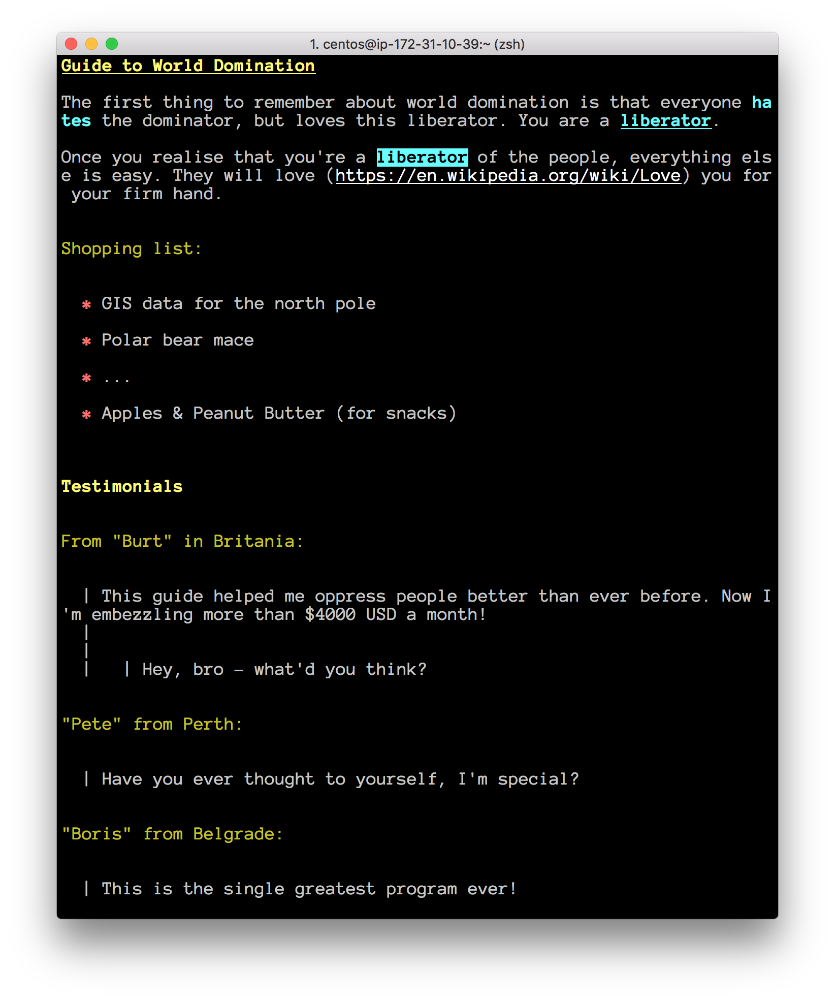

# mdcat 

`mdcat` is a simple application that renders
[markdown](https://daringfireball.net/projects/markdown/) files in a
terminal emulator (e.g. iterm2, gnome terminal).

It attempts to render the markdown in a more readable manner than the
source.

## Instalation

To install `mdcat`, set your `GOPATH` to where you'd like it installed (e.g.
`export GOPATH=~/go`), and then:

    $ go get github.com/samfoo/mdcat

Before running, make sure your `PATH` includes `$GOPATH/bin`, e.g.

    $ export PATH=$PATH:$GOPATH/bin

## Example

## See Also

* [blackfriday - golang markdown parser](https://github.com/russross/blackfriday)
* [ansi - golang ansi console formatting](https://github.com/mgutz/ansi)
